# Architecture

## Runtime flow

```mermaid
flowchart LR
    A["Chinese description and/or rough sketch"] --> B["MockWeaponInterpreter"]
    B --> C["Validated WeaponBlueprint"]
    C --> D["MockWeaponImageGenerator"]
    D --> E["Procedural 96x96 pixel image"]
    E --> F["Alpha mask and profile anchor resolver"]
    F --> G["Deterministic combat rules"]
    G --> H["Training"]
    H --> I["Room 1"]
    I --> J["One validated BlueprintDelta or recast"]
    J --> K["Room 2"]
    K --> L["Local survey and JSONL metrics"]
```

## Authority boundary

The interpreter may select identity, player-facing name/summary, one of three behavior families, element, signature effect, drawback, grip-profile hint, and modification intent. The image generator may suggest pixels only.

Local deterministic code owns executable damage, cadence, range, collision, cooldown, heat, burn, return path, lifesteal, enemies, guard reduction, victory, final anchors, modification limits, and logging policy. Generated pixels are analyzed but never trusted as direct collision or gameplay code.

## Main modules

- `scripts/data/weapon_blueprint.gd`: strict blueprint, repairs, three fixed fixtures.
- `scripts/data/blueprint_delta.gd`: accepted change plus mandatory tradeoff semantics.
- `scripts/services/*`: replaceable interfaces and offline Mock implementations.
- `scripts/systems/procedural_weapon_renderer.gd`: true low-resolution pixel construction.
- `scripts/systems/anchor_resolver.gd`: alpha bounds, centroid, profile default, local grip correction, muzzle/tip/pivot/secondary grip, JSON override.
- `scripts/ui/sketch_canvas.gd`: in-session stroke evidence and geometry summary.
- `scripts/systems/gameplay_arena.gd`: player, three enemy problems, attacks, health, movement, and stage completion.
- `scripts/systems/event_logger.gd`: local metadata-only JSONL.
- `scripts/main.gd`: finite Forge-to-survey orchestration.

## Failure model

Interpreter/image failures preserve in-memory description and sketch, display an explicit error code, allow retry, and expose an explicitly labeled `LOCAL SAMPLE` route. Failure does not equip an unrelated weapon or claim success.

## Model adapter seam

`WeaponInterpreter.interpret` and `WeaponImageGenerator.generate` are the only intended future model seams. `TBD`: provider, model, network boundary, authentication, privacy review, budget, and abuse controls. Those decisions are intentionally absent from V1.

